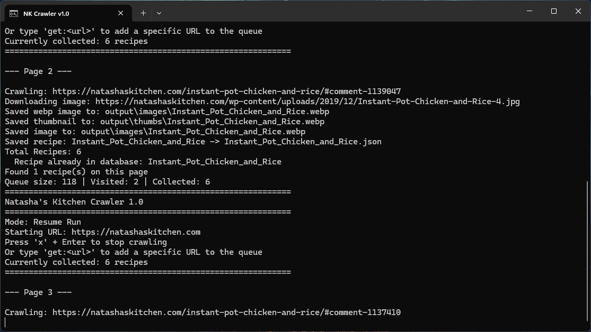
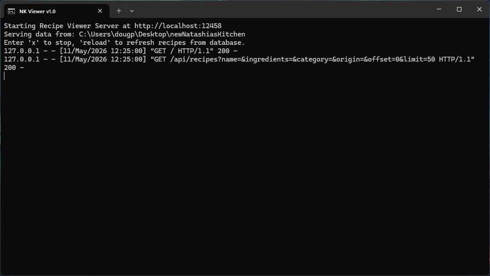
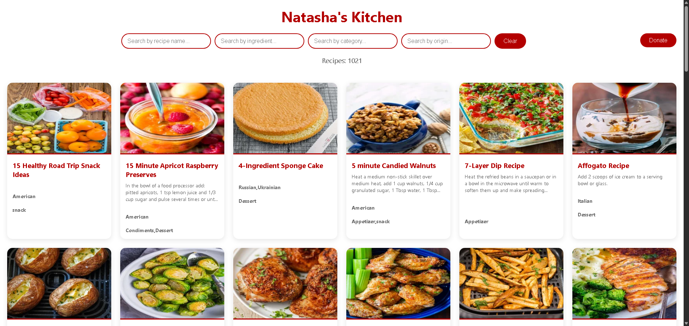

# Natasha's Kitchen Crawler v1.0

A Python script using Selenium to crawl [natashaskitchen.com](https://natashaskitchen.com) and extract recipe data.

## Features

- Enjoy ad-free recipe browsing
- Extracts recipes from `natashaskitchen.com`
- Downloads a recipe image (250x250 or larger)
- Saves each recipe as an individual JSON file in `output/`
- Images saved to `output/images/`
- Automatic resume from last position if interrupted
- Skips already collected recipes
- Stop script via 'x' input or Ctrl+C
- Supports `--fullrun` flag to start from beginning
- `x` stops script (both crawler and viewer)
- `reload` reloads the database for the viewer

## Quick Start: (Windows)

- Clone or Download package and extract to a folder
- Double click `NKCrawler.cmd` to begin collecting recipes
- Double click `NKViewer.cmd` to view gathered recipes
- `NKViewer.cmd` can be launched while `NKCrawler.cmd` is running

## Installation

1. Install Python 3.8+
2. Install Chrome browser
3. Install dependencies:

```bash
pip install -r requirements.txt
```

### Normal Run (Resume Enabled)
```bash
python nkc.py
```

The script will automatically resume from where it left off if previously interrupted.

### Full Run (Start from Beginning)
```bash
python nkc.py --fullrun
```

Ignores saved progress and starts fresh from the homepage.

## After Gathering Some Recipes
```bash
python nkv.py
```

Allows viewing recipes in an HTML layout.

## Directory Structure

```
NatashiasKitchenCrawler/
├── .nk/*                       # Python Virtual Environment (Automatically Created)
├── output/*                    # Collected Recipes and Data (Automatically Created)
├── python/*                    # Embedded Python v3.14.0
├── skip/                       # Directory to store skip word/url definitions
│   ├── ignore.json             # Word based ignore list
│   └── skiplist.json           # URL based ignore list
├── templates/                  # Directory containing templates for viewer front end
│   ├── index.html              # Main HTML template for viewing recipes
│   ├── noimage.jpg             # Fallback image incase no recipe image found
│   └── noodles.png             # Favicon used in index.html
├── screenshots/*               # Screenshots of Crawler and Viewer
├── nkc.py                      # Main crawler script
├── nkv.py                      # Main viewer script
├── requirements.txt            # Minimum python dependencies
├── NKCrawler.cmd               # Quick start crawler batch command
├── NKViewer.cmd                # Quick start viewer batch command
├── LICENSE.md                  # License Information
├── README.md                   # This file
├── error.log                   # Errors get written here (at least most of them - Automatically Created)
├── nkc.lock                    # Prevent running multiple instance crawler (Automatically Created)
└── nkv.lock                    # Prevent running multiple instance viewer (Automatically Created)
```

### Stopping the Crawler

- Type `x` and press Enter to stop gracefully
- Press Ctrl+C to stop (handled gracefully)
- Progress is automatically saved on shutdown

## Output Format

Each recipe JSON file contains (Just as example):
```json
{
  "name": "Recipe_Name",
  "origin": [
    "American",
    "German",
    "..."
  ],
  "category": [
    "Dessert",
    "Dinner",
    "Cake"
  ],
  "ingredients": [
    "1 Cup Salted Butter",
    "1 tsp. Sugar",
    "..."
  ],
  "instructions": [
    "Step 1 ...",
    "Step 2 ...",
    "..."
  ],
  "href": "https://",
  "site": "natashaskitchen.com",
  "url": "https://natashaskitchen.com/Recipe_Name/",
  "image": true,
  "v": "1.0",
  "extracted_at": "2026-05-10T18:36:06.379697"
}
```

## Notes

- Only recipes with valid structured data are collected
- Images are filtered to accept a minimum of 250x250 pixels
- Special characters are removed from filenames
- Already collected recipes are automatically skipped on resume
- Use `--fullrun` to start checking links from beginning of crawl (Will not lose already gathered)
- Use `get:<url>` to manually add a recipe link (ex. get:https://somelink.com/recipe/)
- If you need to rebuild your database file, simply delete the old one `output/db/nk.db`
  then run Crawler again and it will rebuild the file contents.
- Database rebuilding does require the JSON files in `output/`

## To-Do

- Possibly other features as time allows

## License

- Attribution-NonCommercial-NoDerivatives 4.0 International
- For educational purposes only. Respect Natasha's Kitchen terms of service.

## Donate

[Donate via Paypal](https://www.paypal.com/donate/?hosted_button_id=JJ2KF3GDK9C38)

## Screenshots






